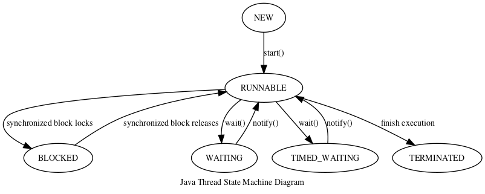

Table of Contents
=================

   * [Chapter 2](#chapter-2)
      * [Java thread state](#java-thread-state)
      * [Start a thread](#start-a-thread)
      * [Stop a thread](#stop-a-thread)
      * [Interrupt a thread](#interrupt-a-thread)


# Chapter 2


## Java thread state


Compared to WAITING, TIMED_WAITING means wait for a period of time.


## Start a thread
To start a thread:
1. Implement a Runnable interface.
1. Add parallel code in run method.
1. Pass in Runnable class into Thread class constructor.
1. Get new thread object and call `start()` method.

See example `CreateThread.java`.


## Stop a thread
Don't call `stop()` method in the thread object. It may force releasing lock in an unexpected way that causes inconsistent state of object. It may also cause resource leak. See example `StopThreadUnsafe.java`.


## Interrupt a thread
Notify a thread to terminate from outside. It is up to thread determine how and when to terminate execution.

```Java
void interrupt() // set interrupt flag
boolean isInterrupted() // check if interrupt flag is set
static boolean Thread.interrupted() // check if interrupt flag is set and clear interrupt state
```

Calling `interrupt()` can wake up from `wait()` and `sleep()` with an InterruptedException. It clears up interrupt flag. See example `InterruptThread.java` and `InterruptAndStopThread.java`.
